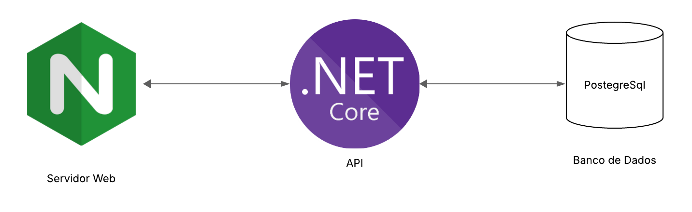

# Projeto Desafio Desenvolvedor - 3C Hunting

Este é um repositório que hospeda o projeto-desafio proposto pela 3C Hunting.

## Pré-Requisitos 
- [Docker](https://www.docker.com/) instalado na máquina.

## Arquitetura do Projeto

O projeto foi pensando para possuir uma arquitetura simples e que minimamente sirva para produção.



## Como Executar

Abra um terminal na raíz do projeto e execute o comando abaixo:

```bash
docker-compose up -d --build
```

## Possíveis Melhorias

- Infraestrutura: Adição de Redis. (Melhoria de performance)
- Infraestrutura: Multiplas Intâncias da API, unido a um Load-balancer. (Melhoria de disponibilidade)
- Segurança: Autenticação por Token. 
- Segurança: Adição de Certificado SSL para HTTPS.
- Código: Separação dos end-points em classes de Controllers individuais.
- Documentação: Descrever melhor o README.md
- Documentação: Detalhar melhor o Swagger.

## Author: @AntonioGomes42 (br.com.antoniogomes@mail.com)
